# serverless について

serverlessに関する技術、およびプロダクトの学習・開発を目的としたプロジェクトです。

## ydl-serverについて  
ydl-serverサービスはKEDAを利用し、非同期的にyoutube動画をダウンロードするアプリケーション群である。  

### youtube-dlについて  
youtube-dlはyoutubeからの動画ダウンロードや音声抽出が可能なコマンドラインプログラムである。  
https://github.com/ytdl-org/youtube-dl  

本プロジェクトで用いているyt-dlpはyoutube-dlからforkされた派生プロジェクトで、機能追加・バグ修正版が行われている。  
https://github.com/yt-dlp/yt-dlp

### ydl-serverの仕組み

ydl-serverは次のコンポーネントで構成される  
- ydl-apiserver : REST APIサーバ、クライアントからのRESTの取得・Metrics APIサーバへのタスク情報送信を行う  
- ydl-downloader: RESTサーバから情報を取得し、yt-dlpを稼働させるコンテナ  
- ydl-converter : RESTサーバから情報を取得し、ffmpegを稼働させるコンテナ

以下のような構造で動作する。  


### ydl-serverのセットアップ  
RaspberryPi上にk8s環境およびgitlabサーバがあることを前提としています。

1) KEDAをクラスタ上に構築する
RaspberryPi上にデプロイする場合は、arm64アーキテクチャ用イメージの使用、またはkedaをビルドし、マニフェスト内の参照先イメージを書き換えること
```sh 
kubectl apply -k ./serverless/keda/base/
```

2) ydl-apiserver、ydl-converter、ydl-downloaderイメージをgitlab等でdockerfileをビルドする

3) REST-APIサーバ・スケーラーを起動する
カスタマイズを行う場合、`overlay`ディレクトリを作成してkustomizeすると良い。
```sh
kubectl apply -k ./serverless/manifests/ydl-server/base/
```

### ydl-serverの利用方法

ydl-apiserverに紐づくExternalIPに対してGETリクエストを送信する。
```sh
curl "http://<Serviceで設定したEXTERNAL-IP>/request?fmt=<フォーマット>&url=<youtubeのURL>"
```

youtubeからのダウンロードについては、現在以下のフォーマットに対応している  
- mp4  (mp4 + aac  : low~1080p程度 環境依存しない形式）  
- webm (webm + webm: FHD/1080p以上 高画質の投稿形式)  

特に指定をしない場合はmp4が自動的に設定される。  

### 注釈  

2020年の改正著作権法により、違法にアップロードされた著作物のダウンロードは違法になりました。  
youtube-dl、およびfork先のyt-dlp利用の際は自己責任でお願いいたします。

youtube-dl        : https://yt-dl.org  
youtube-dl(github): https://github.com/ytdl-org/youtube-dl  
yt-dlp(github)    : https://github.com/yt-dlp/yt-dlp
