# kedaについて

KEDAはkubernetes上で動作するイベントドリブンアーキテクチャである。
https://keda.sh  
https://qiita.com/Junichi_M_/items/bb00a2fdc0a702217659  

## keda on raspberry pi

KEDAはarmアーキテクチャに対応していない  

暫定対処として、有志のdocker imageに置き換えて利用している(v2.1.0)  
https://github.com/kedacore/keda/issues/779  

## Metrics API serverについて

KEDAのMetrics API serverを用いると、特定のREST APIサーバから情報を一定期間毎に取得し、
オートスケールすることが可能になっている  

|コンポーネント|備考|
-|-
|ScaledObject |コンテナとtrigger（Metrics API server）を接続するコンポーネント|
|REST API server| Metrics API Serverが情報を取得する取得先（コンテナ可能）|
|scaling container| 任意のコンテナ|

REST APIであれば形式を問わないため、イベントソースとして汎用性が非常に高い。  

## 参考  

https://qiita.com/k-penguin-sato/items/deaeab18aa416496e273    
https://qiita.com/pylor1n/items/36912a47c893ea5782cc  
https://cabi99.hatenablog.com/entry/2021/01/14/083000  